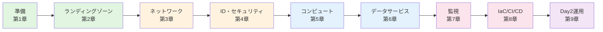

# はじめに

本書は、AWS（Amazon Web Services）や GCP（Google Cloud Platform）など、他のパブリッククラウドで豊富な経験を持つ中上級エンジニアが、Microsoft Azure の世界に迅速かつ効果的に適応するための実践的なハンドブックです。

クラウドの基本概念（IaaS/PaaS/SaaS、ネットワーク、IAM 等）は既に理解していることを前提とし、Azure 特有の概念やリソース管理方法を、**CLI（`az` コマンド）** と **IaC（Bicep/Terraform）** を中心に、対話形式で解説していきます。

## 本書の哲学：CLI First, Portal Second

多くの入門書では、直感的に理解しやすいグラフィカルな Azure Portal を使った操作が紹介されます。しかし、実務での環境構築や運用では、再現性、自動化、そしてバージョン管理が不可欠です。これらは、コマンドラインツールや IaC を用いて初めて実現できます。

そこで本書は、あえて **「CLIファースト」** の原則を貫きます。すべての操作は、まず `az` コマンドで実行します。これにより、あなたは以下のスキルを最短距離で獲得できます。

- **再現可能な手順**: 手作業によるミスや設定漏れを防ぎ、誰が実行しても同じ結果を得られます。
- **自動化への道筋**: シェルスクリプトや CI/CD パイプラインへの組み込みが容易になります。
- **"Infrastructure as Code" の素養**: Bicep や Terraform へのステップアップがスムーズになります。

## 本書の学習パス

本書を通じて、以下の流れで Azure のスキルを体系的に習得していきます。

## 本書のゴール

「**他クラウドの感覚で Azure を正しく使う**」スキルを体系的に獲得することが、本書の最終ゴールです。Azure Portal の画面操作を一つひとつ追うのではなく、コマンドラインでの再現可能な環境構築を通じて、以下の能力を身につけます。

- 企業のガバナンス要件を満たすための最小限のランディングゾーン設計・実装
- セキュアなネットワーク基盤（ハブ＆スポーク、プライベート接続）の構築
- 主要な PaaS（コンテナ、データベース等）の IaC によるプロビジョニングと運用
- 監視、ログ、アラート設定、および運用自動化の基本パターンの習得

各章はハンズオン形式で構成されており、「コマンドの実行」「設計意図の理解」「実行結果の検証」「リソースのクリーンアップ」をワンセットで学べるようになっています。

さあ、あなたのターミナルを開いて、Azure CLI の世界へ飛び込みましょう。