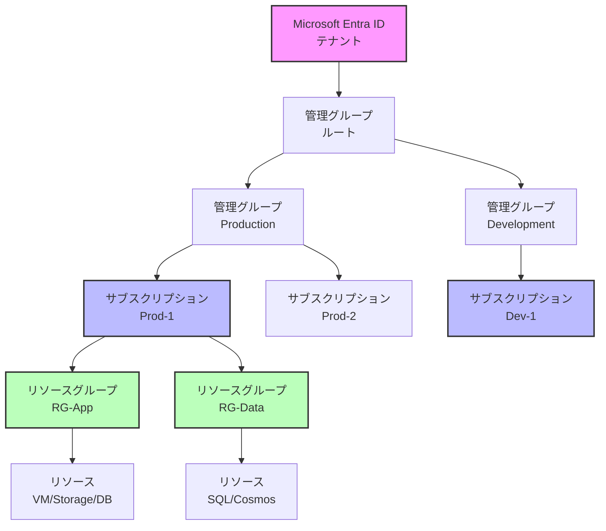
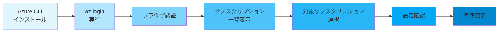

# 第1章: 準備

この章では、本書のハンズオンを進めるための準備作業を行います。Azure との対話の基本となる用語の整理、CLI 環境のセットアップ、そして今後のリソース管理の基準となる命名・タグ規約について定義します。

## 1. 用語整理：AWS/GCP経験者向けのポイント

まず、AWS/GCP 経験者が混同しやすい Azure の基本用語を確認します。特に **リソースグループ** の概念は Azure の根幹をなすため、しっかり理解しましょう。

### Azure のリソース階層構造



| Azure                               | AWS                               | GCP                        | 説明とポイント                                                                                             |
| ----------------------------------- | --------------------------------- | -------------------------- | ---------------------------------------------------------------------------------------------------------- |
| **Microsoft Entra ID** (旧 Azure AD) | IAM (Identity Center)             | Cloud Identity / IAM       | テナント全体の ID とアクセス管理の基盤。ユーザ、グループ、サービスプリンシパルを管理します。         |
| **管理グループ** (Management Group)   | AWS Organizations (OUs)           | Resource Hierarchy (Folders) | 複数のサブスクリプションを束ねてポリシーや RBAC を一括適用するための階層構造です。ガバナンスの起点となります。             |
| **サブスクリプション** (Subscription) | AWS Account                       | Project                    | 課金と管理の単位。リソースをデプロイする境界です。AWSアカウントやGCPプロジェクトに相当します。                                             |
| **リソースグループ** (Resource Group) | (リソース単位 or CloudFormation Stack) | (リソース単位)             | **Azureで最も重要な概念の一つ。** 全てのリソースは必ずいずれか一つのリソースグループに所属します。リソースのライフサイクル（作成、更新、削除）を共有するコンテナとして機能し、RBACやポリシーの適用スコープにもなります。 |
| **リージョン** (Region)               | Region                            | Region                     | データセンターの物理的な場所。`japaneast` (東日本), `westus3` (米国西部3) など、Azureのリージョン名は小文字でスペースがありません。 |

## 2. CLI 環境のセットアップ

ローカルマシンまたは Azure Cloud Shell で作業します。Cloud Shell を使えば、ツールがプリインストールされているためすぐに始めることができます。ローカルで実行する場合は、以下のツールがインストールされ、パスが通っていることを確認してください。

- [Azure CLI](https://learn.microsoft.com/ja-jp/cli/azure/install-azure-cli)
- [Bicep](https://learn.microsoft.com/ja-jp/azure/bicep/install) (Azure CLI に統合)
- [Terraform](https://developer.hashicorp.com/terraform/install) (第8章以降で利用)

### 2.1. バージョン確認

お使いの環境で、各ツールが正しくインストールされているか確認しましょう。

```bash
# Azure CLI のバージョンを確認
az version

# Bicep CLI のバージョンを確認
az bicep version

# Terraform のバージョンを確認 (任意)
terraform -version
```

### 2.2. Azure へのログインとサブスクリプション設定

次に、ハンズオンで使用する Azure アカウントにログインします。



**手順1: ログイン**

以下のコマンドを実行すると、Webブラウザが自動的に起動し、認証を求められます。

```bash
az login
```

**手順2: サブスクリプションの確認**

複数のサブスクリプションにアクセスできる場合は、意図したサブスクリプションで作業することが重要です。利用可能なサブスクリプションの一覧を表示します。

```bash
az account list --output table
```

**手順3: 対象サブスクリプションの設定**

ハンズオンで使用したいサブスクリプションの `SubscriptionId` または `Name` を指定して、現在のセッションのデフォルトに設定します。

```bash
# 下記の <YOUR_SUBSCRIPTION_ID> をご自身のサブスクリプションIDに置き換えてください
az account set --subscription "<YOUR_SUBSCRIPTION_ID>"
```

設定が正しく反映されたか、再度確認しましょう。`isDefault` が `true` になっているものが現在の対象です。

```bash
az account show --query "{name:name, id:id, isDefault:isDefault}" --output table
```

### 2.3. 既定値の設定 (任意)

毎回リージョンを指定する手間を省くため、既定のリージョンを設定しておくと便利です。

```bash
# 既定のリージョンを東日本に設定
az config set defaults.location=japaneast
```

## 3. 命名・タグ規約

リソースの識別と管理を容易にするため、一貫した命名規則とタグ戦略を定めます。これは小規模なプロジェクトでも実践すべき、重要な習慣です。

- **命名規則**: `<sys>-<env>-<region>-<resourcetype>-<seq>`
  - 例: `hdbk-dev-jpe-rg-001` (handbook, development, Japan East, Resource Group, 001)
- **タグ**:
  - `env`: 環境 (e.g., `handbook`, `dev`, `stg`, `prod`)
  - `owner`: 作成者・責任者
  - `costCenter`: コストセンター
  - `createdDate`: 作成日 (e.g., `2025-09-15`)

## 4. ハンズオン: 共通リソースグループの作成

それでは、最初のハンズオンです。本書全体で利用する可能性のある、共通のリソースグループを作成してみましょう。

### 手順1: 変数の定義

コマンドを再利用しやすく、間違いを減らすために、繰り返し使う値は変数に格納します。

```bash
# プレフィックス（接頭辞）を定義
export PREFIX="hdbk"

# リソースグループ名を定義
export RG_COMMON="rg-${PREFIX}-common"

# リージョンを定義
export LOCATION="japaneast"

# 所有者タグの値を定義 (ご自身の名前に変更してください)
export OWNER_NAME="<YOUR_NAME>"
```

### 手順2: リソースグループの作成

`az group create` コマンドを使い、定義した変数を用いてリソースグループを作成します。`--tags` パラメータで、リソースのメタデータを付与できる点に注目してください。

```bash
az group create \
  --name $RG_COMMON \
  --location $LOCATION \
  --tags env=handbook owner=$OWNER_NAME createdDate=$(date +%Y-%m-%d)
```

### 手順3: 検証

コマンドを実行したら、必ずその結果を確認します。`az group show` コマンドで、作成したリソースグループの情報を JSON 形式で取得し、意図通りに作成されたかを確認しましょう。

```bash
az group show --name $RG_COMMON --query "{Name:name, Location:location, Tags:tags}" --output jsonc
```

**【成功の確認】**
以下のようなJSONが出力され、`Name`、`Location`、`Tags` が手順2で指定したものと一致していれば成功です。

```json
{
  "Name": "rg-hdbk-common",
  "Location": "japaneast",
  "Tags": {
    "createdDate": "2025-09-15",
    "env": "handbook",
    "owner": "<YOUR_NAME>"
  }
}
```

### 手順4: 後片付け

このリソースグループは後続の章でも利用する可能性があるため、**この段階では削除しません。**
各章の最後には、コスト管理のために作成したリソースを削除する「後片付け」のセクションがありますが、今回はスキップします。

---

お疲れ様でした。これで、Azure CLI を使った基本的なリソース操作（作成と確認）のサイクルを体験できました。

```