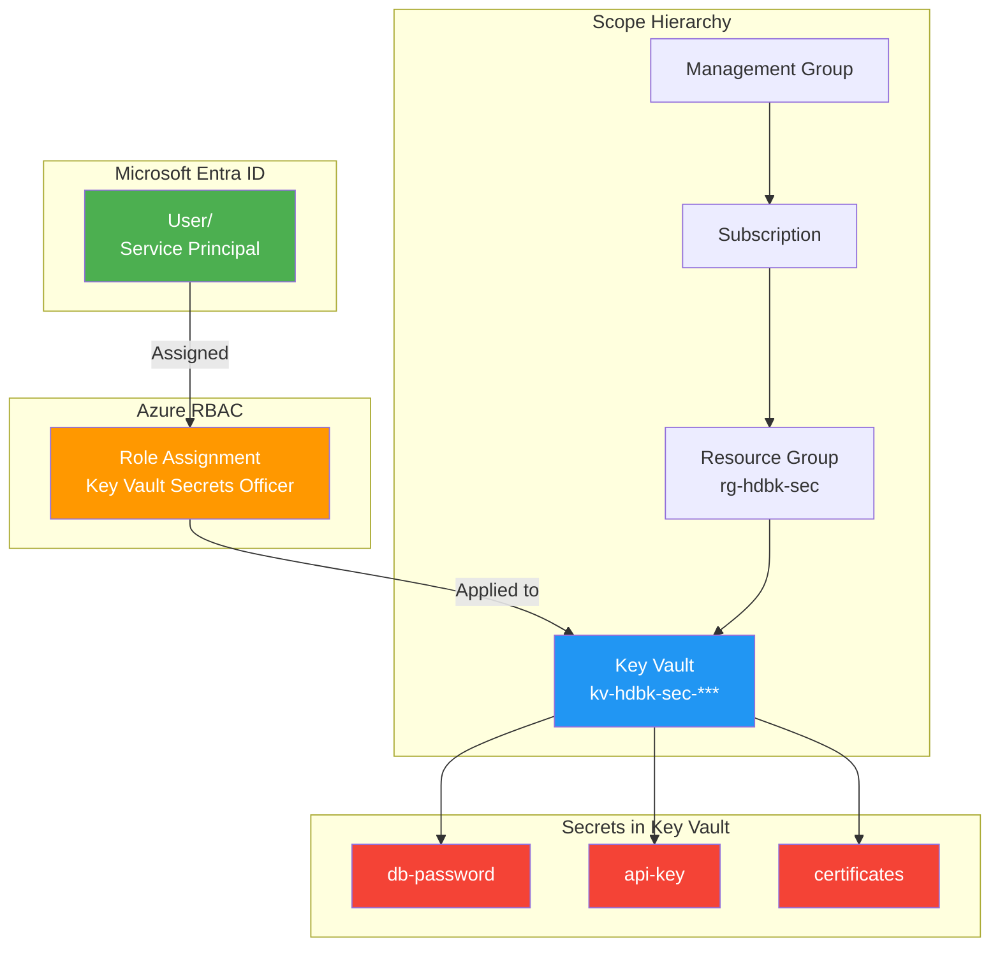
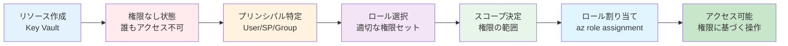

# 第4章: ID/セキュリティ基盤

第3章でネットワークという「境界防御」を構築しました。しかし、堅牢な城壁があっても、城の中の鍵や通行許可証の管理がずさんでは意味がありません。この章では、城の中のセキュリティ、すなわち「誰が」「何に」アクセスできるのかを制御する **ID / アクセス管理** と、大切な鍵（パスワードなど）を安全に保管する **シークレット管理** について学びます。

この章で中心的に扱うのは、以下の2つのサービスです。

1.  **RBAC (Role-Based Access Control)**: Azure リソースへのアクセス許可を管理する仕組みです。「誰に（プリンシパル）」「どの範囲で（スコープ）」「何を許可するか（ロール）」をきめ細かく定義できます。これは AWS の IAM ポリシーとロール、GCP の IAM の考え方と共通しています。

2.  **Azure Key Vault**: パスワード、APIキー、証明書といった機密情報を、ハードウェアセキュリティモジュール (HSM) によって保護された環境で安全に格納・管理するための一元的なサービスです。AWS の Secrets Manager や KMS、GCP の Secret Manager や Cloud KMS の役割を統合的に担います。

この章のハンズオンを終えると、あなたは「最小権限の原則」に従ってリソースへのアクセスを制御し、アプリケーションの資格情報をソースコードから分離して安全に管理するための、基本的かつ極めて重要なスキルを習得できます。

## RBAC とセキュリティアーキテクチャ



### RBAC の権限付与フロー



---

## ハンズオン：Key Vault と RBAC によるシークレット管理

### 1. ゴール

- RBAC モードで動作する Azure Key Vault を作成する。
- 自分自身（ログインユーザー）にシークレットを管理する権限を RBAC で付与する。
- Key Vault にデータベースのパスワードを想定したシークレットを格納し、CLI で安全に取得できることを確認する。

### 2. 手順1: 変数定義

この章用のリソースグループと、グローバルで一意な名前が必要な Key Vault のための変数を定義します。

```bash
export PREFIX="hdbk-sec"
export RG="rg-${PREFIX}"
export LOCATION="japaneast"

# Key Vault名はグローバルで一意にする必要があるため、ランダムなサフィックスを追加
export KV_NAME="kv-${PREFIX}-${RANDOM}"
```

### 3. 手順2: Key Vault の作成とRBACの設定

**ステップ 2-1: リソースグループの作成**

```bash
az group create --name $RG --location $LOCATION
```

**ステップ 2-2: Key Vault の作成 (RBAC有効化モード)**

`az keyvault create` コマンドで Key Vault を作成します。ここで最も重要なのは `--enable-rbac-authorization` フラグです。これにより、Key Vault のアクセス権限を、従来の「アクセスポリシー」モデルではなく、Azure 全体で一貫した RBAC モデルで管理できるようになります。**現在はこちらのRBACモデルが推奨されています。**

```bash
az keyvault create \
  --resource-group $RG \
  --name $KV_NAME \
  --location $LOCATION \
  --enable-rbac-authorization
```

**ステップ 2-3: RBAC による権限割り当て**

Key Vault を作成しただけでは、作成者であっても中身（シークレットなど）を操作することはできません。明確に権限を付与する必要があります。

ここでは、現在ログインしている自分自身に対して、「Key Vault Secrets Officer」というロールを割り当てます。このロールには、シークレットの読み取り、追加、更新、削除の権限が含まれています。

```bash
# 現在サインインしているユーザーのIDを取得
export SIGNED_IN_USER_ID=$(az ad signed-in-user show --query id --output tsv)

# Key VaultのリソースIDを取得
export KV_SCOPE=$(az keyvault show --name $KV_NAME --query id --output tsv)

# ユーザーにロールを割り当て
az role assignment create \
  --role "Key Vault Secrets Officer" \
  --assignee-object-id $SIGNED_IN_USER_ID \
  --scope $KV_SCOPE
```

- `--role`: 割り当てるロール名。
- `--assignee-object-id`: 権限を付与される対象（プリンシパル）のオブジェクトID。
- `--scope`: 権限が有効な範囲。今回は作成した Key Vault のみに限定しています。

### 4. 手順3: シークレットの格納と取得

権限が付与されたので、実際にシークレットを操作してみましょう。

**ステップ 3-1: シークレットの格納**

`az keyvault secret set` コマンドを使い、`my-db-password` という名前でダミーのパスワードを格納します。

```bash
az keyvault secret set \
  --vault-name $KV_NAME \
  --name "my-db-password" \
  --value "P@ssw0rd12345!"
```

**ステップ 3-2: シークレットの取得**

格納したシークレットを `az keyvault secret show` コマンドで取得します。レスポンスの `value` フィールドに、格納したパスワードが表示されることを確認してください。

```bash
az keyvault secret show \
  --vault-name $KV_NAME \
  --name "my-db-password" \
  --query "value" --output tsv
```

### 5. 検証

**検証1: シークレットの取得**

上記の手順 3-2 で、格納したパスワード `P@ssw0rd12345!` が正しく表示されれば、権限付与とシークレット操作が成功していることになります。

**検証2: 権限割り当ての確認**

`az role assignment list` を使って、Key Vault のスコープに意図したロールが割り当てられていることを確認できます。

```bash
# --scope にKey VaultのリソースIDを指定
az role assignment list --scope $KV_SCOPE --output table
```

**【成功の確認】**
`Role` が `Key Vault Secrets Officer` となっており、`PrincipalName` がご自身のユーザー名になっていれば成功です。

### 6. 後片付け

この章で作成したリソースを、リソースグループごと削除します。

```bash
az group delete --name $RG --yes --no-wait

echo "Resource group '$RG' is being deleted."
```

---

お疲れ様でした。これで、Azure における ID/アクセス管理とシークレット管理の基本を習得しました。Key Vault と RBAC を組み合わせることで、アプリケーションは安全に機密情報へアクセスでき、開発者はコードにパスワードを埋め込む必要がなくなります。

次の章では、いよいよアプリケーションの実行環境となるコンピュートとコンテナのサービスについて学びます。
