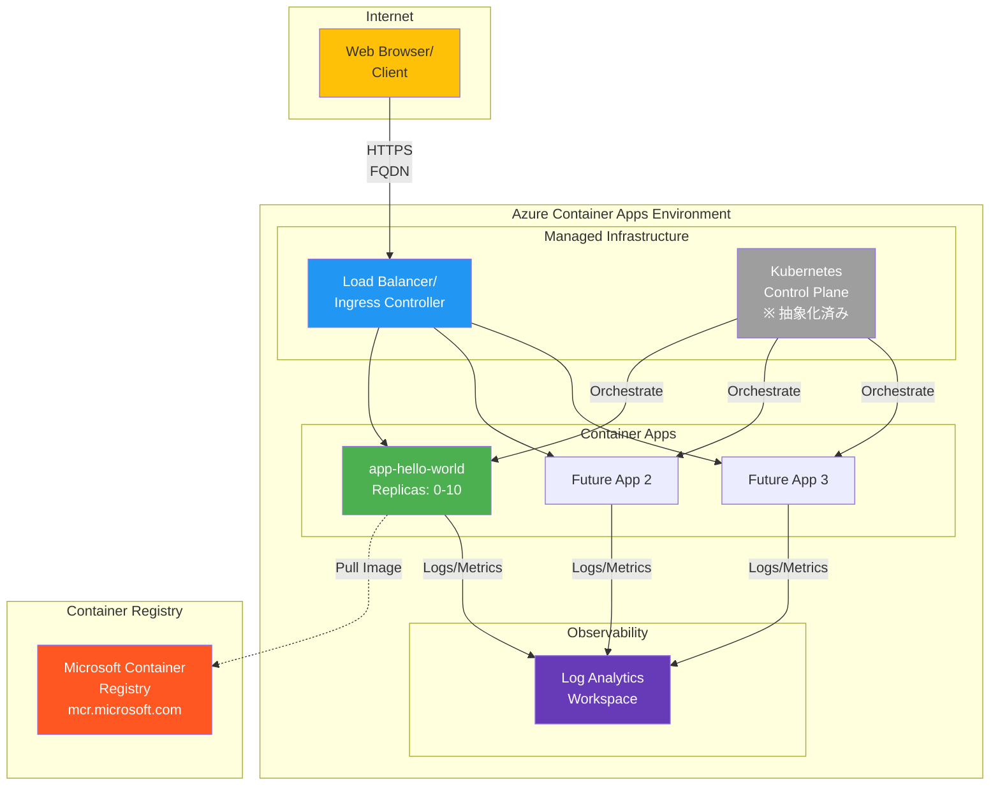
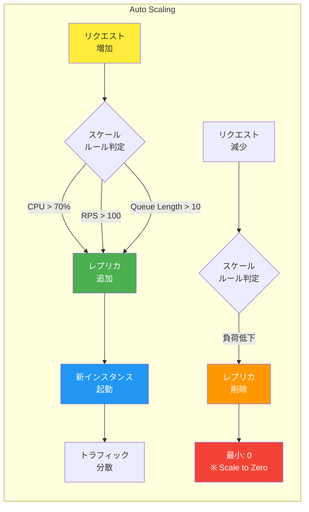

# 第5章: コンピュート & コンテナ

これまでの章で、ネットワーク、ID、セキュリティというアプリケーションを支えるための強固な基盤を築いてきました。いよいよ、その上でアプリケーションコードを動かすための「実行環境」を構築します。

Azure には、仮想マシン (IaaS) からサーバーレス (PaaS) まで、多彩なコンピュート（計算）サービスが存在します。他のクラウドと同様、どのサービスを選択するかは、アプリケーションの要件や、あなたが管理したいインフラの範囲によって決まります。

- **Azure Virtual Machines (VM)**: AWS の EC2 や GCP の Compute Engine に相当する、最も基本的な IaaS です。OSレベルからの完全な制御が必要な場合に選択します。
- **Azure Kubernetes Service (AKS)**: AWS の EKS や GCP の GKE に相当する、マネージド Kubernetes サービスです。マイクロサービスアーキテクチャのための強力なコンテナオーケストレーション機能を提供しますが、Kubernetes 自体の学習コストや運用オーバーヘッドが伴います。
- **Azure Container Apps (ACA)**: **本章の主役です。** これは、Kubernetes のパワーをベースにしながらも、その複雑さを完全に抽象化してくれるサーバーレスコンテナ実行環境です。AWS Fargate や Google Cloud Run に非常に近いコンセプトのサービスで、インフラを意識することなくコンテナをデプロイし、スケーリングさせたい場合に最適です。

この章では、最も手軽かつモダンなアプローチである **Azure Container Apps** を使って、コンテナ化されたアプリケーションを世界に公開するハンズオンを体験します。

## Azure Container Apps アーキテクチャ



### Container Apps のスケーリング動作



---

## ハンズオン：Azure Container Apps で "Hello World"

### 1. ゴール

- Azure Container Apps を使って、公開されている "Hello World" コンテナイメージをデプロイする。
- デプロイされたアプリケーションに、インターネット経由で払い出された FQDN (完全修飾ドメイン名) を使ってアクセスできることを確認する。

### 2. 手順1: 変数定義

この章用のリソースグループと、Container Apps 環境およびアプリケーションの名前を定義します。

```bash
export PREFIX="hdbk-app"
export RG="rg-${PREFIX}"
export LOCATION="japaneast"

# Container Apps 環境名
export ACA_ENV="acaenv-${PREFIX}"

# Container App 名
export ACA_APP="app-hello-world"
```

### 3. 手順2: Container Apps のデプロイ

**ステップ 2-1: リソースグループの作成**

```bash
az group create --name $RG --location $LOCATION
```

**ステップ 2-2: 必要なリソースプロバイダーの登録**

Azure では、一部のサービスを初めて利用する際に、サブスクリプションにそのサービスのリソースプロバイダーを登録する必要があります。Container Apps を利用するために、`Microsoft.App` と `Microsoft.OperationalInsights` を登録しておきましょう。（Log Analytics で利用するため後者も必要です）

```bash
az provider register --namespace Microsoft.App
az provider register --namespace Microsoft.OperationalInsights
```

**ステップ 2-3: Container Apps 環境の作成**

Container Apps をデプロイするには、まず **Container Apps 環境 (Environment)** というリソースが必要です。これは、複数のコンテナアプリをホストするための論理的な境界であり、VNet やログの構成を共有します。この「環境」が、内部的に Log Analytics ワークスペースと紐づいてログを自動的に収集してくれます。

```bash
az containerapp env create \
  --resource-group $RG \
  --name $ACA_ENV \
  --location $LOCATION
```

**ステップ 2-4: コンテナアプリの作成と公開**

いよいよコンテナアプリを作成します。`az containerapp create` コマンドは非常に強力で、これ一つでコンテナイメージの指定、リソース（CPU/メモリ）要求、スケーリングルール、そして外部への公開設定まで完結できます。

今回は、Microsoft が提供している公開コンテナイメージ `mcr.microsoft.com/azuredocs/containerapps-helloworld:latest` を使います。

- `--ingress external`: アプリケーションをインターネットに公開する設定です。
- `--target-port 80`: コンテナがリクエストを待ち受けているポート番号を指定します。

```bash
az containerapp create \
  --resource-group $RG \
  --name $ACA_APP \
  --environment $ACA_ENV \
  --image mcr.microsoft.com/azuredocs/containerapps-helloworld:latest \
  --ingress external \
  --target-port 80
```

### 4. 検証

**検証1: アプリケーションへのアクセス**

`az containerapp create` コマンドが成功すると、出力JSONの中に `properties.configuration.ingress.fqdn` という項目で、アプリケーションのURLが生成されています。このURLに `curl` コマンドでアクセスしてみましょう。

まず、`az containerapp show` コマンドで FQDN を取得して変数に格納します。

```bash
# アプリケーションのFQDNを取得
export APP_FQDN=$(az containerapp show --resource-group $RG --name $ACA_APP --query "properties.configuration.ingress.fqdn" --output tsv)

echo "Application URL: https://${APP_FQDN}"

# curlでアクセス
curl "https://${APP_FQDN}"
```

**【成功の確認】**
`Hello World!` というHTMLが出力されれば、デプロイと公開は成功です。

**検証2: Container App の状態確認**

`az containerapp show` コマンドで、アプリケーションの詳細な状態を確認できます。

```bash
az containerapp show --resource-group $RG --name $ACA_APP --output jsonc
```

`provisioningState` が `Succeeded` になっていることや、`ingress` の設定などを確認できます。

### 5. 後片付け

この章で作成したリソースを、リソースグループごと削除します。

```bash
az group delete --name $RG --yes --no-wait

echo "Resource group '$RG' is being deleted."
```

---

お疲れ様でした。驚くほど簡単なステップで、コンテナアプリケーションをインターネットに公開できましたね。これがサーバーレスコンテナプラットフォームである Azure Container Apps の威力です。

次の章では、アプリケーションに欠かせない「データ」を扱うための、Azure のデータサービスについて学びます。
