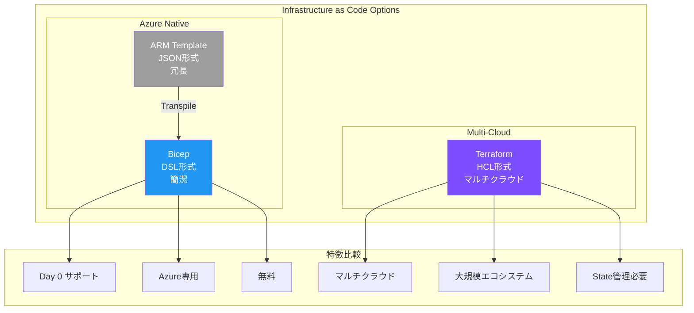

# 第8章: IaC & CI/CD

これまでの章では、`az` コマンドを一つ一つ手で実行し、Azureリソースを構築・設定してきました。この方法は学習の初期段階では有効ですが、実運用ではいくつかの課題があります。

- **再現性の欠如**: 同じ環境をもう一度、間違いなく作れますか？手順書が古くなっていたり、人的ミスが起きる可能性があります。
- **変更管理の困難**: 誰が、いつ、何を、なぜ変更したのか、追跡が困難です。
- **スケールしない**: 100個のリソースグループに同じ変更を適用するのは、現実的ではありません。

これらの課題を解決するのが、**Infrastructure as Code (IaC)** と **CI/CD** のプラクティスです。

1.  **Infrastructure as Code (IaC)**: インフラ（ネットワーク、ストレージ、コンピュートなど）の構成を、人間が手で操作するのではなく、**コード（テキストファイル）**で記述する手法です。コードで管理することで、Gitによるバージョン管理、チームでのレビュー、再利用が可能になります。Azureにおける主要なIaC言語が、この章で学ぶ **Bicep** です。

2.  **CI/CD (継続的インテグレーション/継続的デプロイメント)**: IaCで記述されたコードを、Gitへのプッシュなどをトリガーにして、**自動的にテスト・デプロイ**する仕組みです。手作業を排除し、迅速かつ安全に変更を本番環境へ反映させることができます。この章では **GitHub Actions** を利用します。

この章を終えれば、あなたは手動でのCLI操作から脱却し、コードに基づいたインフラ管理と、それを自動デプロイする最新のDevOpsワークフローを構築できるようになります。

## IaC と CI/CD パイプライン

```mermaid
graph LR
    subgraph "Development"
        Dev[Developer]
        Code[Bicep/Terraform<br/>Code]
        Git[Git Repository]
    end

    subgraph "CI/CD Pipeline"
        GHA[GitHub Actions/<br/>Azure DevOps]
        Validate[構文検証]
        Plan[変更計画]
        Test[テスト環境<br/>デプロイ]
        Approve[承認]
        Deploy[本番環境<br/>デプロイ]
    end

    subgraph "Azure Environment"
        RG[Resource Groups]
        Resources[Azure Resources]
        State[State Storage]
    end

    Dev -->|Write| Code
    Code -->|Push| Git
    Git -->|Trigger| GHA
    GHA --> Validate
    Validate --> Plan
    Plan --> Test
    Test --> Approve
    Approve --> Deploy
    Deploy --> RG
    RG --> Resources
    Resources -.->|State| State
    State -.->|Reference| Plan

    style Dev fill:#4caf50,color:#fff
    style GHA fill:#ff9800,color:#fff
    style Deploy fill:#2196f3,color:#fff
    style Resources fill:#9c27b0,color:#fff
```



### Bicep vs ARM Template vs Terraform



---

## Bicep とは？

Bicepは、Azureリソースを宣言的に展開するためにMicrosoftが開発したドメイン固有言語（DSL）です。主な特徴は以下の通りです。

- **シンプルな構文**: JSON (ARMテンプレート) よりも遥かに簡潔で読みやすい構文です。
- **Day 0 サポート**: 新しいAzureの機能がリリースされたその日から、Bicepで利用できます。
- **モジュール化**: 共通の構成を「モジュール」として再利用可能な部品にできます。
- **強力な型付けとIntelliSense**: VS Code拡張機能により、コーディング中にパラメータやプロパティを補完してくれます。

例えば、ストレージアカウントを作成する場合、CLIとBicepでは以下のようになります。

**CLI (命令的)**
```bash
az storage account create --name <...> --resource-group <...> --sku <...>
```

**Bicep (宣言的)**
```bicep
resource stg 'Microsoft.Storage/storageAccounts@2023-01-01' = {
  name: '<...>'
  location: resourceGroup().location
  kind: 'StorageV2'
  sku: {
    name: 'Standard_LRS'
  }
}
```

Bicepは「最終的にどういう状態であってほしいか」を記述するのに対し、CLIは「何をするか」を一つ一つ指示する、という違いがあります。

---

## ハンズオン：Bicep と GitHub Actions でストレージアカウントをデプロイする

### 1. ゴール

- ストレージアカウントを定義したBicepファイルを作成する。
- GitHub ActionsのCI/CDパイプラインを構築し、mainブランチへのプッシュをトリガーにして、BicepファイルをAzureに自動デプロイする。
- パイプラインの認証には、パスワードを使わない安全な **OIDC (OpenID Connect)** を利用する。

### 2. 手順1: Bicepファイルの作成

まず、デプロイするリソースをBicepで記述します。以下の内容で、リポジトリの `infra/bicep/` ディレクトリに `main.bicep` と `main.parameters.json` を作成します。（次のツールコールでファイルが自動的に作成されます）

- `main.bicep`: ストレージアカウントを1つ定義します。名前はパラメータで受け取るようにします。
- `main.parameters.json`: `main.bicep` に渡すパラメータ（ストレージアカウント名）を定義します。

### 3. 手順2: GitHub Actions ワークフローの作成

次に、CI/CDの本体であるGitHub Actionsのワークフローファイルを作成します。以下の内容で、リポジトリのルートに `.github/workflows/deploy.yml` を作成します。（次のツールコールでファイルが自動的に作成されます）

このワークフローは以下の処理を行います。

1.  `main` ブランチにコードがプッシュされたら起動します。
2.  OIDCを使ってAzureにログインします。（`azure/login` アクション）
3.  `az deployment group create` コマンドを実行して、`main.bicep` をデプロイします。

### 4. 手順3: AzureとGitHubのOIDC連携設定 (重要・手作業)

GitHub ActionsがパスワードなしでAzureにログインするためには、Azure ADとGitHubリポジトリの間で信頼関係を構築する必要があります。**この手順はCLIエージェントでは実行できないため、あなた自身でWebブラウザを使って設定する必要があります。**

**[こちらのMicrosoft公式チュートリアル](https://learn.microsoft.com/ja-jp/azure/developer/github/connect-from-azure?tabs=azure-portal%2Cwindows#use-the-azure-login-action-with-openid-connect)** に従い、以下の作業を行ってください。

1.  **Azure AD アプリケーションを作成**します。
2.  作成したADアプリケーションに、GitHubリポジトリを信頼させるための **フェデレーション資格情報** を追加します。
    - `Organization/Repository`: `<YOUR_GITHUB_USER>/azure-handbook`
    - `Entity type`: `Branch`
    - `Branch name`: `main`
3.  作成したADアプリケーションの**サービスプリンシパル**に対して、デプロイ先のリソースグループに対する `Contributor` ロールを割り当てます。
4.  GitHubリポジトリの **Settings > Secrets and variables > Actions** に、以下の3つのシークレットを登録します。
    - `AZURE_CLIENT_ID`: ADアプリケーションの「アプリケーション (クライアント) ID」。
    - `AZURE_TENANT_ID`: お使いのAzureテナントの「テナントID」。
    - `AZURE_SUBSCRIPTION_ID`: お使いのAzureサブスクリプションの「サブスクリプションID」。

この設定が完了すると、GitHub Actionsの `azure/login` アクションが、これらのIDを使ってAzureから一時的なアクセストークンを取得できるようになります。

### 5. 検証

1.  上記の手順3まで完了したら、ローカルリポジトリの変更を `git push` して、GitHubの `main` ブランチに反映させます。
2.  リポジトリの **Actions** タブを開き、`Deploy Bicep to Azure` ワークフローが自動的に実行され、すべてのステップが緑色のチェックマークで完了することを確認します。
3.  ワークフロー完了後、ローカルのターミナルで以下のコマンドを実行し、ストレージアカウントがAzure上に作成されていることを確認します。

    ```bash
    # パラメータファイルで定義したリソースグループとストレージアカウント名
    export RG_NAME="rg-hdbk-iac"
    export SA_NAME="sthdbkiac$RANDOM" # パラメータファイルと合わせる

    az storage account show --resource-group $RG_NAME --name $SA_NAME
    ```

**【成功の確認】**
コマンドが成功し、ストレージアカウントの情報がJSONで表示されれば、CI/CDパイプラインによる自動デプロイは成功です。

### 6. 後片付け

CI/CDパイプラインによって作成されたリソースグループを削除します。

```bash
az group delete --name rg-hdbk-iac --yes --no-wait
```

---

お疲れ様でした。この章では、手作業のCLIからIaCとCI/CDによる自動化へと、大きな飛躍を遂げました。この考え方は、Azureだけでなく、あらゆるモダンなクラウド環境で必須となるスキルです。

次の章では、これまでの総まとめとして、実際の運用（Day2）で必要となる様々な操作を「Runbook」として学びます。
